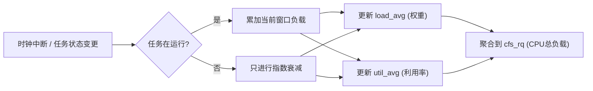
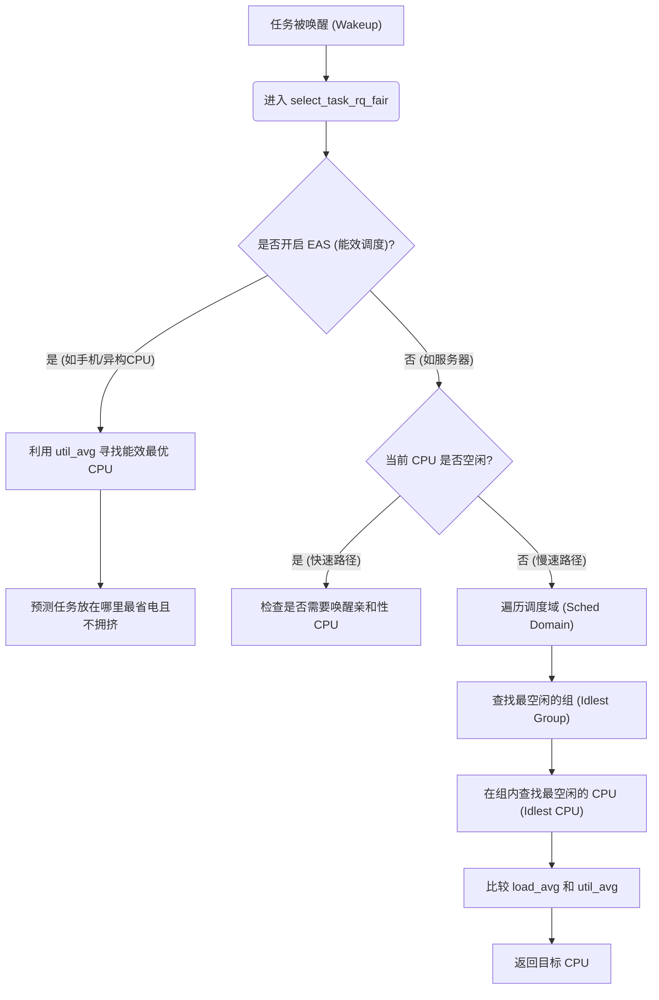
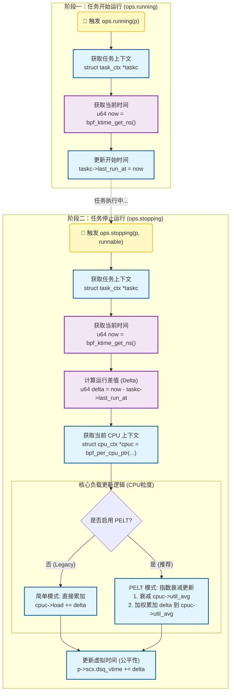

# Linux 内核 CFS 调度器：负载追踪与选核机制详解

## 1. 核心概念：什么是“负载” (Load)？

在 CFS 中，“负载”并不是一个单一的数值，而是分为两个维度的指标，它们在不同的场景下起作用：

### A. 权重负载 (Load / Weight)

- **定义**：基于任务优先级的负载。
- **来源**：与 `nice` 值（及 cgroup 权重）直接相关。
  - `nice 0` 的权重是 1024。
  - `nice -20` (高优先级) 权重极大。
- **用途**：主要用于**负载均衡 (Load Balance)**。内核希望所有 CPU 上的“总权重”大致相等。如果 CPU A 上有一个 nice -20 的任务，CPU B 上有 10 个 nice 19 的任务，CFS 会认为这两个 CPU 负载可能是平衡的，因为高优先级任务理应获得更多 CPU 时间。

### B. 利用率 (Utilization / Capacity)

- **定义**：基于物理时间的负载。
- **来源**：任务实际在 CPU 上运行了多长时间（0% ~ 100%）。
- **用途**：主要用于**选核 (Task Placement)** 和 **调频 (Schedutil)**。例如，一个任务即使优先级很高，但如果它 90% 的时间都在睡眠（等待 I/O），它的利用率就很低。内核会把它放在较空闲或能效更好的核上。

------

## 2. 核心算法：PELT (Per-Entity Load Tracking)

为了准确统计上述指标，Linux 使用了 **PELT（实体负载跟踪）** 算法。

### 为什么需要 PELT？

在 PELT 之前，内核通常只统计整个运行队列（Runqueue）的负载。这导致了一个问题：当一个繁重的任务迁移到新 CPU 时，新 CPU 的负载会瞬间暴涨，旧 CPU 瞬间暴跌，导致调度波动。

PELT 实现了**实体级**的跟踪：**负载是跟着任务（Entity）走的**。任务去哪，负载就带到哪。

### 算法原理

PELT 将时间切分成 1024us（约 1ms）的窗口。它使用**指数衰减移动平均 (Geometric Series / Exponential Decay)** 算法。

- **衰减因子**：$y = 1/32^{\frac{1}{32}}$。简单理解：**负载每经过 32ms，影响力就会减半（半衰期）**。

- **公式逻辑**：

  $$L_t = L_{t-1} \cdot y + P_t$$

  - $L_t$：当前时刻的负载。
  - $L_{t-1}$：上一时刻的负载（衰减后）。
  - $P_t$：当前窗口内的贡献（如果任务在运行，就是 1；如果在睡觉，就是 0）。

- 

- Shutterstock

*(此处概念图描述：一个曲线图。当任务开始运行时，利用率曲线不是瞬间跳到 100%，而是像电容充电一样平滑上升；当任务停止运行时，曲线平滑下降，而不是瞬间归零。)*

### 流程图：PELT 更新机制




------

## 3. CFS 如何统计 CPU 负载？

CFS 的统计是自下而上的层级汇总。

1. **调度实体 (`se`, Scheduling Entity)**：每个任务（或任务组）都有自己的 `se.avg` 结构体，里面维护了 `load_avg` 和 `util_avg`。
2. **运行队列 (`cfs_rq`, Runqueue)**：每个 CPU 都有一个 `cfs_rq`。
   - **CPU 的负载 = 该 CPU 上所有 `se` 的负载之和**。
3. **更新时机**：
   - **enqueue/dequeue**：任务进入或离开队列时。
   - **tick**：每次时钟中断时。
   - **update_curr**：任务在运行时累积时间。

**关键点**：即使任务在睡觉（Blocked），PELT 也会计算其“阻塞负载”。当它醒来时，内核知道它之前是个“忙碌”的任务，而不是把它当成新任务从 0 开始算。

------

## 4. 选核时如何获取负载信息？

在 CFS 中，“选核”主要发生在两个时刻：**Fork（创建新进程）** 和 **Wakeup（唤醒进程）**。最常用的是 Wakeup 路径（`select_task_rq_fair`）。

### 流程：唤醒选核逻辑 (Wakeup Path)

代码段



### 关键步骤解析：

1. **EAS (Energy Aware Scheduling) 优先**：

   如果系统支持 EAS（常见于移动端），内核会直接读取任务的 `util_avg`。

   - 如果 `util_avg` 很小，放在小核（Little Core）。
   - 如果 `util_avg` 很大，放在大核（Big Core）。
   - **依据**：纯粹看利用率，不看权重。

2. **空闲搜索 (Idle Search)**：

   如果没有 EAS，CFS 会优先寻找 **Idle CPU**。

   - 内核会快速扫描 LLC 域内的 CPU，看谁的利用率极低。

3. **负载均衡 (Load Balancing)**：

   如果 CPU 都很忙，则比较 `load_avg`（权重负载）。

   - 目标：将任务放到 `load_avg` 最低的 CPU 上，或者放到与其上次运行的 CPU 共享缓存的 CPU 上（Cache Affinity）。

------

## 5. 总结

| **指标**     | **变量名 (内核)**  | **含义**                        | **主要用途**                        | **算法基础** |
| ------------ | ------------------ | ------------------------------- | ----------------------------------- | ------------ |
| **权重负载** | `se->avg.load_avg` | 任务的繁忙程度 × 任务优先级     | 决定谁该被迁移 (负载均衡)           | PELT         |
| **利用率**   | `se->avg.util_avg` | 任务占用 CPU 的物理时间比例     | 决定放在大核还是小核，以及 CPU 频率 | PELT         |
| **CPU 容量** | `capacity`         | CPU 的算力上限 (受热、频率影响) | 判断 CPU 是否能容纳当前任务         | 硬件反馈     |

**简单一句话**：PELT 像一个极其灵敏的记录员，给每个任务画了一张“历史画像”（是忙是闲，是很重要还是不重要）。CFS 在选核时，就是拿着这张画像，去寻找最适合这个任务的“工位”（CPU）。


p2dq负载计算是一个“开始-结束”的闭环测量过程：将运行耗时记录在

#### A. 闭环测量 (Start-Stop Measurement)

负载的本质是**CPU 使用时间**。要准确计算一个任务用了多少 CPU，必须知道它“什么时候开始”和“什么时候结束”。

1. **开始 (`p2dq_running`)**: 当任务被调度上 CPU 时，`p2dq_running` 会记录当前时间戳：

   C

   ```
   // scx_p2dq/src/bpf/main.bpf.c
   taskc->last_run_at = now; //
   ```

2. **结束 (`p2dq_stopping`)**: 当任务离开 CPU 时，`p2dq_stopping` 计算差值：

   C

   ```
   // scx_p2dq/src/bpf/main.bpf.c
   used = now - taskc->last_run_at; // 计算本次运行的精确时长
   ```

**为什么准确？** 因为 `stopping` 时刻是任务本次占用 CPU 的**终点**。只有到了终点，我们才能确定它到底跑了多久。如果在任务运行中间去采样（比如每秒扫描一次），反而不如这种基于事件的统计精确。

#### B. 频繁的更新频率 (High Frequency)

你可能会担心：*“如果一个任务一直跑，很久不调用 stopping，负载数据岂不是旧的？”*

在 `scx` 和 `p2dq` 的设计中，这是通过**时间片（Time Slice）**来保证的。

- `p2dq` 设定了 `timeline_config.max_exec_ns`（默认 20ms）。
- 如果一个任务是 CPU 密集型的（一直跑），内核会强制触发时间片中断。
- 这会导致任务被“赶下” CPU（触发 `stopping`），更新负载，然后可能立即又被调度上来（触发 `running`）。

因此，负载数据的更新频率至少是几十毫秒一次，对于负载均衡决策来说，这个“实时性”已经足够准确。

#### C. PELT 算法的集成 (指数衰减)

代码中不仅仅是简单的累加，还使用了类似内核 PELT (Per-Entity Load Tracking) 的算法：

C

```
// scx_p2dq/src/bpf/main.bpf.c -> p2dq_stopping

/* Update PELT metrics if enabled */
if (p2dq_config.pelt_enabled) {
    update_task_pelt(taskc, now, used, task_cpu); // 更新任务的 PELT
    aggregate_pelt_to_llc(llcx, taskc, ...);      // 将任务负载聚合到 LLC
} else {
    __sync_fetch_and_add(&llcx->load, used);      // 简单模式：直接累加时间
}
```

- **`update_task_pelt`**: 这个函数不仅加上了本次运行的 `used` 时间，还会根据距离上次更新的时间间隔进行**指数衰减**。
- 这意味着：旧的负载权重会逐渐降低，新的负载权重更高。这种机制使得 `util_avg` 能够平滑且准确地反映“最近的”负载压力，而不是历史总和。


我们的调度算法：根据p2dq算法进行修改，

1.将llc粒度的负载记录修改成cpu粒度的

2.去除不需要的逻辑，仅记录负载情况和PELT算法(随时间衰减)，使用虚拟时间


添加两个钩子点：

running

stopping

结构体中添加cpu粒度的字段：

```
// 1. 定义上下文
struct task_ctx {
    u64 last_run_at;
};

// 2. Running: 记账开始
void BPF_STRUCT_OPS(my_running, struct task_struct *p)
{
    struct task_ctx *tctx = bpf_task_storage_get(&task_kptr, p, 0, 0);
    if (tctx)
        tctx->last_run_at = bpf_ktime_get_ns(); // 记录开始时间
}

// 3. Stopping: 记账结束 + 算负载
void BPF_STRUCT_OPS(my_stopping, struct task_struct *p, bool runnable)
{
    struct task_ctx *tctx = bpf_task_storage_get(&task_kptr, p, 0, 0);
    if (!tctx) return;

    u64 now = bpf_ktime_get_ns();
    u64 delta = now - tctx->last_run_at; // 算出这次跑了多久

    // A. 算负载 (最简单的累加法，建议换成 PELT)
    struct cpu_ctx *cpuc = bpf_per_cpu_ptr(&cpu_ctxs, bpf_get_smp_processor_id());
    if (cpuc)
        cpuc->load += delta; 

    // B. 算公平性 (如果是 vtime 调度)
    p->scx.dsq_vtime += delta;
}
```




